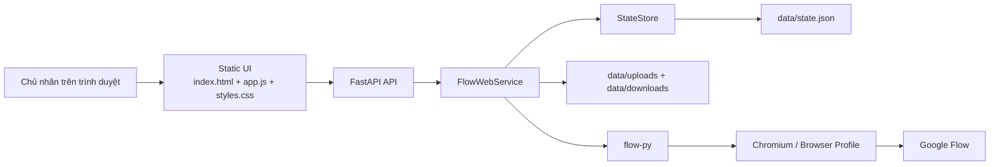

# Architecture Decision Document

_Tài liệu này mô tả kiến trúc hiện trạng của ứng dụng Flow Web UI dựa trên codebase đang chạy. Dự án hiện chưa có PRD riêng, nên các quyết định dưới đây được suy ra từ hành vi thực tế của hệ thống và các ràng buộc đã có._

## 1. Bối Cảnh Và Mục Tiêu

### Mục tiêu

- Bọc `flow-py` thành một ứng dụng web cục bộ dễ dùng hơn cho người không muốn thao tác hoàn toàn bằng code.
- Giữ luồng thao tác ngắn: lưu project, đăng nhập Google Flow, tạo hoặc chỉnh sửa ảnh/video.
- Lưu được trạng thái job, project và file cục bộ để refresh trang vẫn tiếp tục theo dõi được.
- Ưu tiên triển khai nhanh, ít phụ thuộc, dễ sửa trực tiếp trong dự án.

### Phi mục tiêu

- Không xây dựng thành hệ thống nhiều người dùng.
- Không thay thế Google Flow bằng API chính thức.
- Không đưa thêm frontend framework hoặc hàng đợi tác vụ ngoài tiến trình ở giai đoạn này.

## 2. Tóm Tắt Kiến Trúc

Ứng dụng dùng kiến trúc `FastAPI monolith + static frontend + local JSON persistence`. Toàn bộ UI được phục vụ trực tiếp từ backend, và backend gọi `flow-py` để điều khiển Chromium đăng nhập cũng như chạy tác vụ trên Google Flow.

## 3. Các Quyết Định Kiến Trúc Cốt Lõi

### Quyết định 1: Giữ backend theo kiểu monolith mỏng

- `flow_web/main.py` chỉ nên làm routing, mount static files và khởi tạo lifecycle.
- `flow_web/service.py` là lớp orchestration trung tâm.
- `flow_web/store.py` chịu trách nhiệm đọc/ghi state bền vững.

Lý do:
- Dự án nhỏ, luồng nghiệp vụ tập trung, không cần tách microservice.
- Phù hợp với tốc độ thay đổi cao khi Google Flow và `flow-py` còn dễ biến động.

Hệ quả:
- Dễ thay đổi nhanh.
- Cần kỷ luật giữ `main.py` gọn, nếu không logic sẽ bị tràn vào route handlers.

### Quyết định 2: Dùng local JSON thay vì database

- App state được lưu trong `data/state.json`.
- Upload lưu ở `data/uploads`.
- Kết quả tải về lưu ở `data/downloads`.

Lý do:
- Dự án mang tính local companion app, chưa cần truy vấn phức tạp.
- Giảm phụ thuộc và công việc vận hành.

Hệ quả:
- Phù hợp cho một người dùng trên một máy.
- Không tối ưu cho concurrency cao hoặc nhiều tiến trình cùng ghi.

### Quyết định 3: Chạy job nền bằng `asyncio.create_task`

- Mỗi job được enqueue rồi chạy nền trong cùng tiến trình ứng dụng.
- Trạng thái được cập nhật dần qua `patch_job`, `append_log`, `replace_artifacts`.

Lý do:
- Đủ nhẹ cho local app.
- Không cần Redis, Celery hay worker riêng ở giai đoạn hiện tại.

Hệ quả:
- Nếu server restart, job đang chạy sẽ bị ngắt.
- `StateStore` phải tự chuyển job dở dang sang `interrupted` ở lần khởi động sau.

### Quyết định 4: Giữ frontend là static web thuần

- UI hiện được xây bằng HTML/CSS/JS thuần, thao tác DOM trực tiếp trong `flow_web/static/app.js`.

Lý do:
- Không cần build step.
- Dễ sửa nhanh trong repo nhỏ.
- Hợp với mục tiêu giao diện đơn giản, dễ tiếp cận.

Hệ quả:
- Mọi thay đổi `id`, `selector`, cấu trúc HTML phải đồng bộ tay với JS.
- Khi UI phức tạp hơn, cần chú ý tránh để `app.js` phình quá mức.

### Quyết định 5: Chấp nhận `flow-py` là lớp tích hợp không ổn định tuyệt đối

- Google Flow được điều khiển bằng browser automation, không phải API chính thức.
- Lỗi từ Flow phải được chuẩn hóa qua `humanize_flow_error`.

Lý do:
- Đây là cách khả dụng hiện tại để tự động hóa luồng Flow.

Hệ quả:
- Tích hợp có thể gãy khi Google đổi UI.
- UX phải ưu tiên thông báo lỗi rõ ràng, dễ hiểu và có khả năng thử lại.

## 4. Thành Phần Hệ Thống

### 4.1 Backend

#### `flow_web/main.py`

- Khởi tạo `FastAPI`.
- Mount static và file directories.
- Cấp các endpoint chính:
  - `/api/state`
  - `/api/config`
  - `/api/auth/login`
  - `/api/credits`
  - `/api/workflows`
  - `/api/uploads`
  - `/api/jobs`
  - `/api/jobs/{job_id}`
  - `/api/jobs/{job_id}/download`

#### `flow_web/service.py`

- Trung tâm nghiệp vụ của ứng dụng.
- Chịu trách nhiệm:
  - normalize project id và project URL
  - đồng bộ project với storage của `flow-py`
  - enqueue login/job
  - gọi client của `flow-py`
  - xử lý artifacts, download, workflow, credits
  - quản lý thư viện `skills` backend còn tồn tại để tương thích

#### `flow_web/store.py`

- Đọc và ghi `StateSnapshot`.
- Có lock bất đồng bộ để tránh ghi state chồng chéo.
- Tự sửa job dở dang sau restart.

#### `flow_web/schemas.py`

- Mô tả các model chính:
  - `AppConfig`
  - `JobRecord`
  - `JobArtifact`
  - `SkillRecord`
  - `StateSnapshot`
  - request models cho config, jobs, downloads

#### `flow_web/messages.py`

- Chuẩn hóa lỗi kỹ thuật thành câu tiếng Việt dễ hiểu.
- Là điểm chung cần đi qua trước khi hiển thị lỗi Flow cho người dùng.

#### `flow_web/paths.py`

- Nguồn sự thật cho tất cả đường dẫn quan trọng của ứng dụng.

### 4.2 Frontend

#### `flow_web/static/index.html`

- Chia UI thành các khối rõ ràng:
  - hero và setup steps
  - kết nối project
  - tạo nội dung
  - điều hướng nhanh
  - project/workflow đã lưu
  - bảng theo dõi tác vụ

#### `flow_web/static/app.js`

- Giữ state giao diện ở object `state`.
- Tải dữ liệu từ `/api/state`, `/api/jobs`, `/api/workflows`, `/api/credits`.
- Render:
  - project list
  - workflow list
  - assistant tips
  - job stats và job cards
- Gắn handler cho save config, login, create job, load workflow, download artifact.

#### `flow_web/static/styles.css`

- Định nghĩa visual system hiện tại theo hướng dễ tiếp cận, sáng, thân thiện.

## 5. Luồng Dữ Liệu Chính

### 5.1 Luồng khởi động

1. `lifespan()` gọi `ensure_app_dirs()`.
2. Tạo `StateStore`.
3. Tạo `FlowWebService`.
4. Cố gắng nạp thư viện media skills backend nếu có.

### 5.2 Luồng kết nối project

1. Người dùng nhập `project_id` hoặc dán cả URL project.
2. Frontend normalize input trước khi gửi.
3. Backend normalize lại lần nữa trong service.
4. Config mới được lưu vào `data/state.json`.
5. Service đồng bộ project vào storage mà `flow-py` đang dùng.

### 5.3 Luồng đăng nhập

1. Frontend gọi `/api/auth/login`.
2. Backend tạo `JobRecord(type="login")`.
3. `FlowWebService` spawn task `_run_login(...)`.
4. `flow-py` mở Chromium để chủ nhân đăng nhập.
5. UI nhìn thấy job cập nhật qua polling và hiển thị trạng thái mới.

### 5.4 Luồng tạo hoặc sửa nội dung

1. Frontend gửi `CreateJobRequest` tới `/api/jobs`.
2. Backend validate request và tạo job.
3. Task nền gọi đúng phương thức tương ứng của `flow-py`.
4. Trong lúc chờ, service append logs theo tiến độ.
5. Khi có kết quả, artifacts được lưu và có thể tải về máy.

### 5.5 Luồng tải file kết quả

1. Người dùng bấm lưu từ một artifact.
2. Backend dùng client để tải file về thư mục downloads.
3. `public_url` hoặc route `/download/{file_name}` được dùng để mở/lấy file cục bộ.

## 6. Dữ Liệu Và Hợp Đồng API

### Trạng thái nguồn thật

- `StateSnapshot` là snapshot chính cho UI local.
- `/api/state` trả cùng lúc:
  - `config`
  - `jobs`
  - `skills`
  - `projects`
  - `auth`

Quy tắc:
- Không được phá shape của `/api/state` một cách tùy tiện vì frontend đang hydrate trực tiếp từ đây.

### Job model

Một job gồm:
- metadata: `id`, `type`, `status`, `title`
- `input`
- `result`
- `artifacts`
- `logs`
- `error`
- `created_at`, `updated_at`

Quy tắc:
- Nếu thêm loại job mới, phải cập nhật đồng thời validation, title, render UI và trạng thái/label tương ứng.

## 7. Ràng Buộc Kỹ Thuật Và Rủi Ro

### Ràng buộc

- Python phải từ `3.10` trở lên.
- App đang tối ưu cho local machine, single-user.
- Frontend không có build pipeline.
- `flow-py` là phụ thuộc Git bên ngoài và có thể thay đổi theo upstream.

### Rủi ro

- Restart server giữa chừng làm job bị ngắt.
- Google Flow thay đổi UI có thể làm automation hỏng.
- Dùng JSON file khiến scale nhiều tiến trình không an toàn.
- Backend vẫn còn subsystem `skills` để tương thích, dù UI học skill đã được rút khỏi màn hình.

### Giảm thiểu

- Việt hóa và humanize lỗi rõ ràng.
- Giữ service là lớp duy nhất gọi `flow-py`.
- Không tách logic state khỏi `StateStore`.
- Ghi rõ trong project context rằng `_bmad-output` mới là thư mục output chuẩn, không phải `{output_folder}` placeholder.

## 8. Hướng Mở Rộng Được Khuyến Nghị

### Khi thêm tính năng mới

- Ưu tiên thêm trong `service.py`, sau đó nối ra route và UI.
- Chỉ thêm endpoint mới khi không thể mở rộng endpoint sẵn có một cách sạch sẽ.
- Giữ luồng UI tập trung vào ba bước: kết nối, đăng nhập, tạo/chỉnh sửa.

### Khi cần nâng cấp độ ổn định

- Bước tiếp theo hợp lý là tách job execution khỏi tiến trình web.
- Sau đó mới cân nhắc database nếu cần lịch sử lớn hơn hoặc nhiều người dùng.

### Khi cần tái cấu trúc frontend

- Chỉ cân nhắc framework khi `app.js` vượt quá mức dễ kiểm soát.
- Nếu chưa có nhu cầu đó, tiếp tục dùng static frontend để giữ tốc độ triển khai.

## 9. Kết Luận

Kiến trúc hiện tại phù hợp với mục tiêu của dự án: một local web companion app cho Google Flow, ưu tiên dễ dùng, dễ sửa, ít phụ thuộc và phản hồi nhanh. Điểm cần giữ chặt nhất là: logic ở service, state qua store, UI tối giản cho người mới, và coi `flow-py` như một lớp tích hợp có thể gãy nên phải bao bọc kỹ bằng thông báo lỗi và các quy tắc bảo vệ phù hợp.
