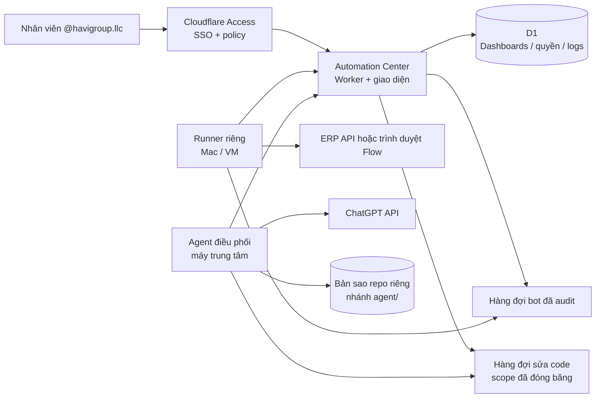

# Kiến trúc Automation Control Center

## Ranh giới chương trình

`dashboards` là đơn vị cô lập chính. Mọi bảng vận hành (`bots`, `approvals`, `dashboard_projects`, `audit_logs`, `dashboard_members`) đều mang `dashboard_id`. Mọi API chi tiết bắt buộc tải dashboard bằng slug rồi kiểm tra membership trước khi đọc hoặc ghi.

Owner nhìn được tất cả dashboard; các vai trò khác chỉ thấy dashboard có bản ghi membership tương ứng. Cấp quyền ở một dashboard không tạo membership ở dashboard khác.

## Vai trò và giới hạn

| Vai trò | Có thể làm | Không thể làm |
| --- | --- | --- |
| Owner | Tạo chương trình, toàn quyền chương trình, quản lý thành viên, gửi và duyệt thay đổi code | Không có cách đặt token trong UI. |
| Admin | Tạo/cấu hình bot, cấp quyền, chạy bot, duyệt, gửi và duyệt thay đổi code | Không tạo dashboard mới, không tự vào dashboard khác, không bật `auto_apply`. |
| Operator | Gửi lệnh chạy, tạm dừng, tiếp tục bot được gán, gửi yêu cầu sửa code | Không thêm user, đổi cấu hình, duyệt — kể cả yêu cầu code của chính mình. |
| Reviewer | Duyệt hoặc từ chối yêu cầu được tạo ở dashboard | Không chạy bot, đổi cấu hình hay gửi yêu cầu sửa code. |
| Viewer | Xem trạng thái, project, lịch sử | Không tạo thay đổi. |

## Runner và bí mật

Cloudflare Worker là control plane, không phải nơi chạy browser automation của Google Flow. Content Image Runner chạy trên máy công ty/VM và chủ động polling Worker qua Cloudflare Access Service Token; Google Flow chỉ lắng nghe `127.0.0.1` trên chính máy đó. Thiết kế runner phải:

- nhận `dashboard_id`, `bot_id`, `project_id` đã được Worker kiểm tra;
- từ chối target nằm ngoài dashboard/project được gán;
- không gửi API secret về browser hoặc audit log;
- trả kết quả, thời gian, lỗi đã làm sạch về Worker;
- dùng secret riêng cho từng connector/runner, xoay vòng được.

## Luồng Agent tạo ảnh Content

1. Operator nhập idea, số ảnh và tỷ lệ trong dashboard.
2. Worker chỉ tạo `bot_run` khi `content-image-runner` vừa heartbeat; nếu offline, không ghi lệnh và UI chỉ hiện hướng dẫn thiết lập.
3. Runner claim một lệnh `queued`, gửi nó vào Flow v2 tại localhost, rồi báo `running`.
4. Bấm **Dừng** khi queued sẽ đổi run thành `cancelled` ngay. Bấm khi running sẽ đổi thành `cancel_requested`; runner gọi endpoint stop của Flow rồi báo kết quả cuối cùng.
5. Khi hoàn tất, runner trả artifact về Worker. Worker tạo một yêu cầu duyệt cho từng ảnh và ghi audit log. Secret, prompt chi tiết và Access credential không hiển thị trong audit.

Không đặt ERP API key/secret trong `public/`, D1, Git hoặc form của Automation Center. Chỉ đưa chúng vào secret store của runner hay Cloudflare Worker, theo connector cần dùng. Khoá OpenAI của Agent điều phối cũng theo quy tắc này: chỉ nằm trong `.env` của runner trên máy trung tâm.

## Luồng Agent điều phối

Nhân viên nhắn yêu cầu sửa code; máy trung tâm đọc repo, gọi ChatGPT, ghi file và chạy test. Máy cá nhân không tham gia.

1. Người dùng mở một thread và gửi tin nhắn. Worker kiểm `code_request`, đọc phạm vi được cấp, và **đóng băng** phạm vi đó vào `code_change_requests.scope_json`. Không có phạm vi → 403. Runner offline → 409, không ghi lệnh.
2. Runner claim yêu cầu `queued` → `planning`. Worker trả về chỉ thị, phạm vi đã đóng băng, danh sách bảo vệ toàn cục và 40 tin nhắn gần nhất của thread.
3. Runner checkout `agent/<id>` từ nhánh base trong **bản sao repo riêng**, lặp tối đa 4 vòng với ChatGPT (`read` → `answer` hoặc `edit`), ghi file, chạy `AGENT_TEST_COMMAND`, rồi commit.
4. Runner báo kết quả kèm diff, danh sách file, số dòng và log test. Worker kiểm lại danh sách file đó với `scope_json`: ngoài phạm vi, vượt trần file/dòng → ép `failed`. Chạm file bảo vệ → `touches_protected`, không bao giờ tự áp dụng. Số dòng lấy giá trị lớn hơn giữa số runner báo và số đếm được trong chính diff sẽ hiển thị cho người duyệt, nên báo thiếu không lách được trần.

   Đây là lớp chặn *lỗi* — lỗi logic hoặc model đi chệch ở runner. Nó **không** chặn được một runner đã bị chiếm: runner vẫn là bên cung cấp cả `files` lẫn `diff_text`. Bảo vệ trước tình huống đó nằm ở chỗ khác: secret của runner và nhánh `agent/<id>` chỉ tồn tại trên máy trung tâm.
5. Trong phạm vi + không chạm file bảo vệ + test xanh + phạm vi có `auto_apply` → `approved` thẳng. Còn lại → `awaiting_approval`, chờ người có `code_approve`. Người gửi không tự duyệt được, trừ Owner. Yêu cầu chạm file bảo vệ chỉ Owner duyệt được.
6. Runner nhận danh sách `approved`, merge nhánh vào base (đẩy remote nếu `AGENT_PUSH_REMOTE`), báo `applied`. Merge lỗi → `git merge --abort` rồi báo `failed`. Mọi lỗi giữa chừng đều `reset --hard`, `clean -fd`, quay về nhánh base và xoá nhánh tạm.

### Agent điều khiển bot khác

Yêu cầu kiểu "dừng bot tạo ảnh" không đi qua git: runner báo `bot_action` kèm tối đa 5 lệnh, Worker kiểm `capability(requested_role, "run")` rồi gọi `runBotCommand` — đúng hàm mà nút bấm trên web gọi — và chốt yêu cầu ở `bot_done`. Actor ghi vào audit là `agent:<email người gửi>`, không phải một danh tính riêng của agent.

Lõi được tách ra dùng chung thay vì viết lại cho agent, vì lối vào của agent là lối ít bị soi hơn: một bản kiểm tra thứ hai sẽ trôi, và bên nới hơn mới là bên có hiệu lực. Runner cũng chỉ nhận được danh sách bot khi người gửi có quyền `run`, nên khi không có quyền thì ChatGPT không có `bot_id` nào để gọi tên.

Hai lớp kiểm phạm vi là cố ý trùng nhau: runner từ chối *ghi* file ngoài phạm vi, Worker từ chối *nhận* kết quả ngoài phạm vi. Runner giữ bản sao `PROTECTED_GLOBS` của riêng nó, nên một Center bị cấu hình sai vẫn không khiến nó đọc hay ghi file bí mật.

`automation_center/src/worker.js` nằm trong danh sách bảo vệ: agent không sửa được chính phần phân quyền đang ràng buộc nó mà không có Owner duyệt tay.

### API

| Endpoint | Ai gọi |
| --- | --- |
| `GET /api/dashboards/:slug/agent` | Người dùng — thread, yêu cầu, phạm vi của mình, trạng thái runner |
| `GET /api/dashboards/:slug/agent/threads/:id` | Người dùng — tin nhắn của một thread |
| `POST /api/dashboards/:slug/agent/threads` | `code_request` |
| `POST /api/dashboards/:slug/agent/threads/:id/messages` | `code_request` — 409 nếu thread còn yêu cầu đang chạy |
| `GET /api/dashboards/:slug/agent/requests/:id/diff` | Người dùng — tải diff khi bấm xem (không đi kèm danh sách) |
| `POST /api/dashboards/:slug/agent/requests/:id` | Duyệt/từ chối (`code_approve`); huỷ (người gửi **hoặc** người có `code_approve`) |
| `POST /api/dashboards/:slug/agent/scopes` | `manage_members`; `auto_apply` chỉ Owner |
| `POST /api/runner/code/claim` | Runner |
| `GET /api/runner/code/approved?runner_key=` | Runner |
| `GET \| POST /api/runner/code/:id` | Runner |

Ranh giới quyền được khoá bằng `tests/permissions.test.mjs`, `tests/test_scope_parity.py` và `tests/test_orchestrator_bot.py`.
